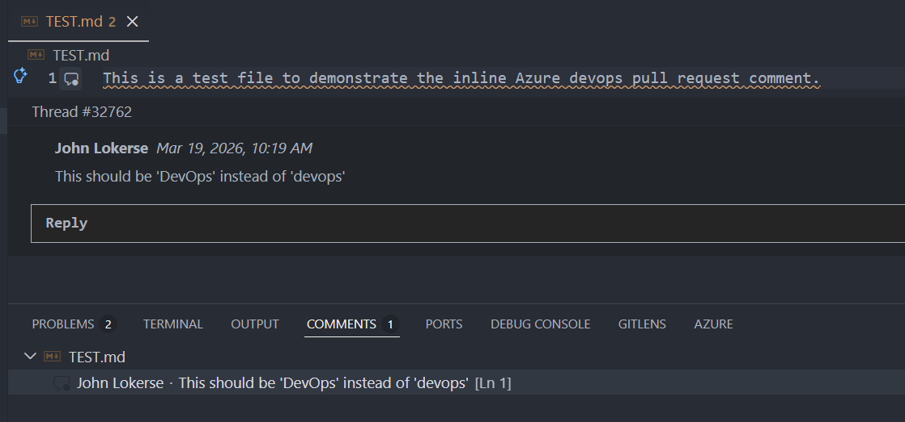

# Azure DevOps PR Comments

This extension shows Azure DevOps pull request comment threads in VS Code.

It is meant for working with an existing pull request from your local branch. You can load the current PR, read file-level review comments in the editor, read PR-level comments in the Comments view, reply to a thread, resolve or reopen a thread, and open the PR in Azure DevOps.

## What it does

- Shows file-level PR comment threads on the lines they belong to
- Shows PR-level comments without an associated file in the VS Code Comments view
- Automatically loads comments when you open VS Code or switch branches
- Renders inline images (screenshots pasted in Azure DevOps) directly in the comment thread
- Lets you reply to an existing thread from VS Code
- Lets you resolve or reopen a thread
- Adds status bar buttons for manual refresh and opening the PR in Azure DevOps
- Shows a live countdown next to the refresh button indicating when the next auto-refresh will occur

## How to use it

1. Open a repository that is cloned from Azure DevOps Services.
2. Run **Azure DevOps PR Comments: Sign In** from the Command Palette.
3. Sign in with your Microsoft/Entra ID work account.
4. If the current branch has an active pull request, the related file-level threads will appear in the editor automatically and PR-level threads will appear in the Comments view.

You can also click the refresh button in the status bar, or run **Azure DevOps PR Comments: Refresh PR Comments** at any time.

## Requirements

- VS Code 1.85 or later
- A repository hosted in Azure DevOps Services (`dev.azure.com`)
- Access to the Azure DevOps organization with a Microsoft/Entra ID account (personal accounts do not work!)

## Settings

| Setting | Default | Description |
|---|---|---|
| `azureDevOpsPrComments.organizationUrl` | *(auto-detect)* | Override the detected Azure DevOps organization URL |
| `azureDevOpsPrComments.project` | *(auto-detect)* | Override the detected Azure DevOps project name |
| `azureDevOpsPrComments.showResolvedThreads` | `false` | Show resolved threads as well |
| `azureDevOpsPrComments.autoRefreshInterval` | `5` | Interval in minutes to automatically refresh PR comments. Set to `0` to disable. |

## Commands

| Command | Description |
|---|---|
| `Azure DevOps PR Comments: Sign In` | Sign in to Azure DevOps |
| `Azure DevOps PR Comments: Sign Out` | Sign out |
| `Azure DevOps PR Comments: Refresh PR Comments` | Load or refresh comments for the current PR |
| `Azure DevOps PR Comments: Open in Azure DevOps` | Open the current PR in Azure DevOps |
| `Azure DevOps PR Comments: Show Diagnostics` | Show basic diagnostics for sign-in, repository detection, and PR lookup |

## Notes

- Comments are loaded automatically on startup, on branch change, and on a configurable polling interval (default every 5 minutes).
- When auto-refresh is enabled, a live countdown is shown next to the refresh button in the status bar (e.g. `↺ 4m` or `↺ 45s`), so you always know when the next refresh will happen.
- Only the first active PR for the current branch is shown.
- Only file-level threads are shown inline. PR-level comments without a file are shown only in the Comments view.
- Creating new top-level review threads is not supported from the editor at the moment.
- Images pasted into Azure DevOps comments are fetched with your sign-in token and cached locally in a temp folder. Only Azure DevOps attachment URLs are resolved; external image URLs are left as-is.
- Azure DevOps Server (on-premises) is not supported.

## Supported remote URL formats

- `https://dev.azure.com/org/project/_git/repo`
- `https://org@dev.azure.com/org/project/_git/repo`
- `https://org.visualstudio.com/project/_git/repo`
- `git@ssh.dev.azure.com:v3/org/project/repo`
